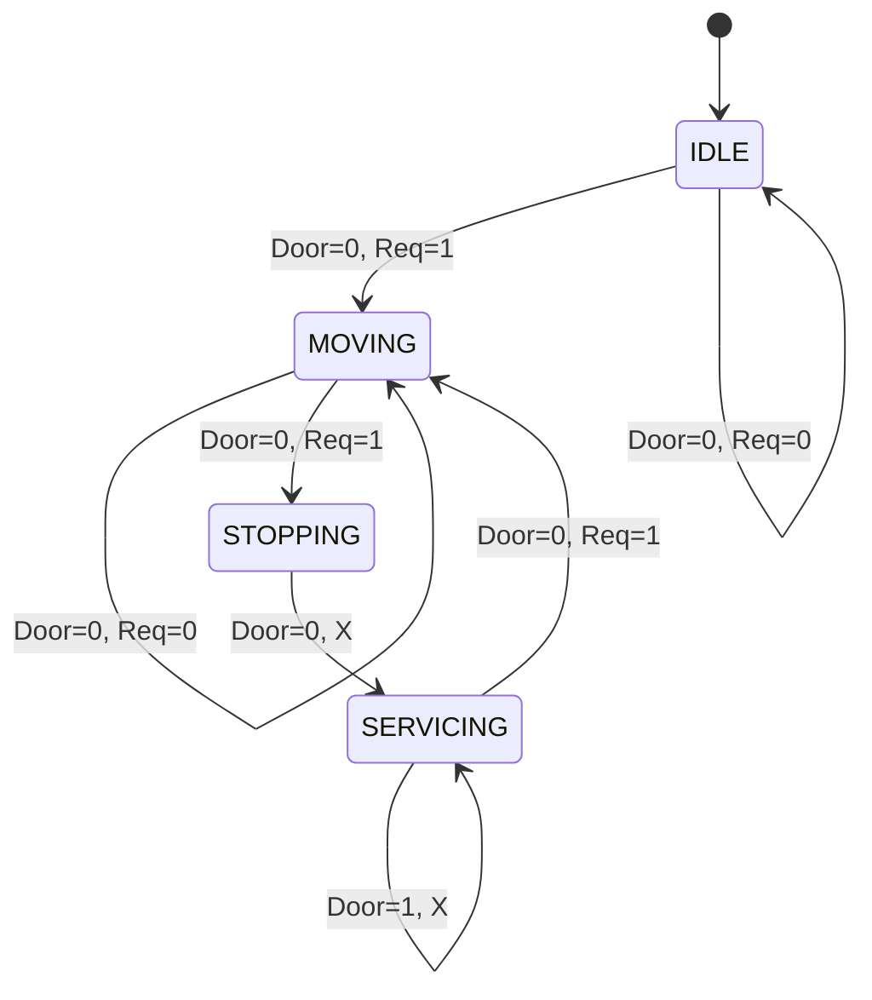

# Elevator-Verification (Arduino Uno)

Created an automated elevator system using digital logic principles, verified in software, and implemented on physical hardware. 

## Design Process

1. **Logic Design**: Start by designing truth table for transitions.
2. **FSM**: Derived FSM from truth table
3. **Software verification**: Implemented prototype logic on Python and wrote a testbench to validate before taping out on Arduino Uno
4. **Physical implementation**: Rewrote logic with C++ code, and then integrated with Arduino Uno, IR sensors, and 7 segment digit display. 

### Elevator Safety Logic Table

| State | Door | Sensor | Output | Next State |
|-------|------|--------|--------|-------------|
| IDLE | 0 | 0 | OFF | IDLE |
| IDLE | 0 | 1 | ON | MOVING |
| MOVING | 0 | 0 | ON | MOVING |
| MOVING | 0 | 1 | OFF | STOPPING |
| STOPPING | 0 | X | OFF | SERVICING |
| SERVICING | 1 | X | OFF | SERVICING |
| SERVICING | 0 | 1 | ON | MOVING |

### Finite State Machine

